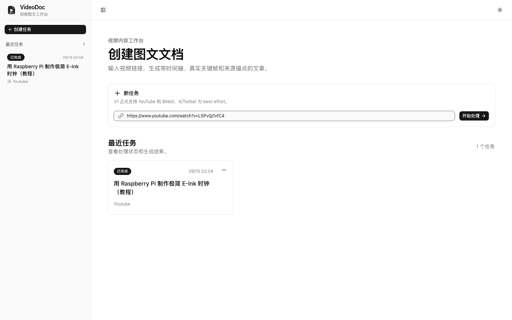
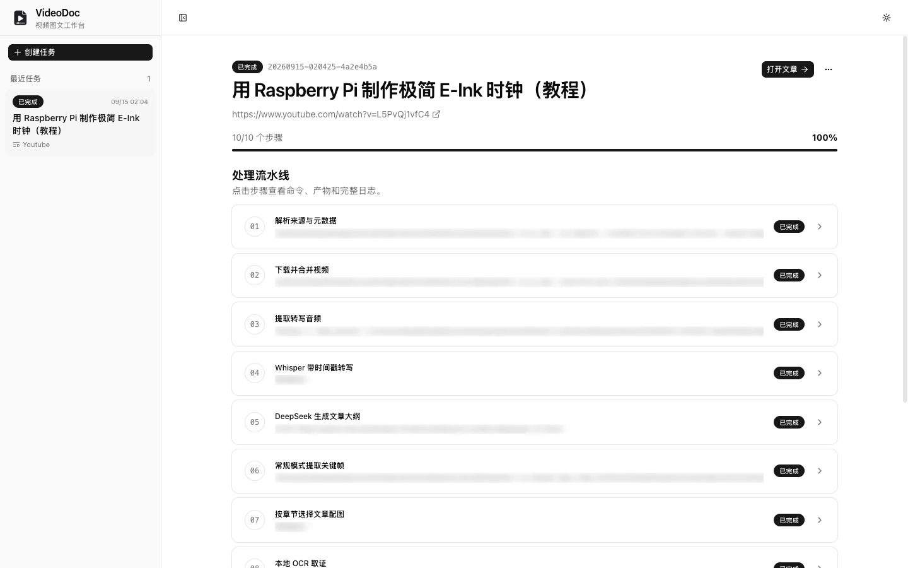
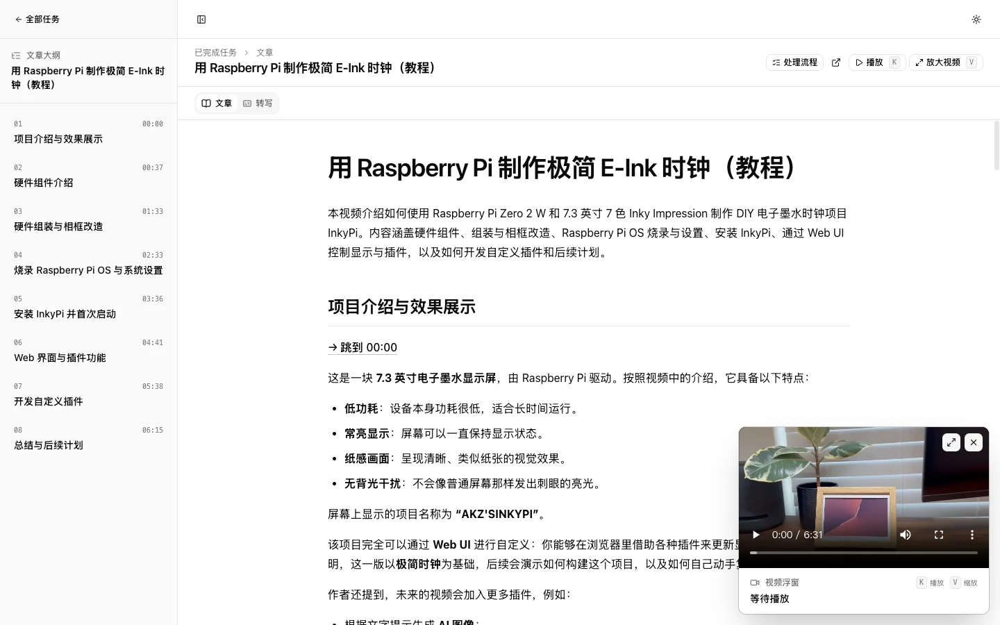

# VideoDoc

**把视频链接转成一篇带时间锚点的中文图文文章。**

[](LICENSE)

## 它做什么

粘贴一个 YouTube 或 Bilibili 链接，VideoDoc 会下载视频、生成带时间戳的转写、
用 LLM 拆分大纲并按章节写正文、提取关键帧选配图（macOS 上还会做本地 OCR 取证），
最终产出一篇带配图的图文文章。

## 操作流程

**1. 粘贴链接**

把 YouTube / Bilibili 链接粘进输入框，点「开始处理」。



**2. 看进度**

任务页会列出十个阶段，从解析来源、下载、转写到抽帧、写稿、收尾。
每个阶段只执行一次，失败会停下来等你在页面上点「重试当前阶段」。



**3. 读文章**

完成后打开文章：左侧是大纲，中间是正文与配图，右下是视频浮窗。



### 怎么用

点左侧大纲的任意章节，**文章和视频会同时跳到那个位置**；
点正文里的「→ 跳到 00:37」或任意配图，视频也会跳过去；
切到「转写」标签点任一片段，视频同样跳到对应时间点。

桌面端快捷键（输入框聚焦时不生效）：

| 键 | 作用 |
|---|---|
| `K` | 播放 / 暂停 |
| `V` | 放大 / 缩小视频浮窗 |
| `Esc` | 从大窗还原为小窗 |

## 快速开始

需要 **Python 3.11+**、**Node 20.19+ 与 pnpm**、**FFmpeg**。

```bash
git clone https://github.com/Shadowzzh/VideoDoc.git
cd VideoDoc

cp .env.example .env      # 填 VIDEODOC_LLM_API_KEY（唯一必填项）
./scripts/serve.sh        # 自动建 venv、装依赖、构建前端
```

打开 <http://127.0.0.1:8765/app/>。换端口：`./scripts/serve.sh 9000`。

<details>
<summary>或手动分步执行</summary>

```bash
python3 -m venv .venv
.venv/bin/pip install -e .
pnpm --dir frontend install && pnpm --dir frontend build
.venv/bin/videodoc --port 8765
```

</details>

## 平台支持

除本地 OCR 外全部跨平台。

| 能力 | 范围 |
|---|---|
| 下载 / 转写 / 抽帧 / LLM / 网页界面 | 全平台（macOS 转写自动启用 Metal） |
| **本地 OCR**（读取配图文字） | **仅 macOS**；其他平台记录日志并跳过，任务继续 |

## 配置

全部通过环境变量或 `.env`（真实环境变量优先，`.env` 只补空缺）。
完整清单见 [`.env.example`](.env.example)，常用的几项：

| 变量 | 默认值 | 说明 |
|---|---|---|
| `VIDEODOC_LLM_API_KEY` | — | **必填** |
| `VIDEODOC_LLM_BASE_URL` | `https://api.deepseek.com` | 任意 OpenAI 兼容端点 |
| `VIDEODOC_LLM_MODEL` | `deepseek-v4-flash` | 模型名 |
| `VIDEODOC_WHISPER_MODEL` | `large-v3-turbo` | 模型名或本地 `.bin` 路径 |
| `VIDEODOC_COOKIE_BROWSER` | `chrome` | 读取哪个浏览器的登录态；设为空则完全关闭 |
| `VIDEODOC_RUNTIME_DIR` | `~/.local/share/videodoc` | 运行产物目录 |

`VIDEODOC_WHISPER_MODEL` 保持默认时，首次运行会自动下载约 1.5GB 的模型。
网络受限可先自行下载 `ggml-*.bin`，再用该变量指向本地文件；
体积敏感也可以用更小的档位，例如 `large-v3-turbo-q5_0`（约 570MB）。

## 已知限制

- 单用户、单 worker，任务顺序执行；JSON 文件存储，不引入数据库
- 正式验收 YouTube 与 Bilibili；X 仅 best-effort
- 本地 OCR 仅 macOS 可用
- 删除任务走可恢复回收站，暂无网页端恢复入口

## 开发

```bash
.venv/bin/pip install -e ".[dev]"
.venv/bin/python -m pytest -q        # 85 项，不访问网络
pnpm --dir frontend typecheck
pnpm --dir frontend test
```

```text
videodoc/
├── cli.py / config.py / server.py
├── pipeline.py            # 十步流水线
├── task_store.py          # JSON 状态与断点续跑
└── integrations/          # crv 抽帧、whisper 转写、macOS OCR
frontend/                  # React + TypeScript + Vite + Tailwind + shadcn/ui
examples/                  # 示例产物（/sample 展示用）
```

流水线：`probe → download → audio → transcribe → outline → frames → select_images → ocr → article → finalize`

## 许可

[MIT](LICENSE)
