# 花 110 美元，用 Raspberry Pi 做一台永不停机的墨水屏时钟

> 一台 7.3 寸墨水屏，一块树莓派 Zero 2 W，一个宜家相框 —— 拼出一台会自己更新内容的电子纸小屏。这篇文章拆解 AKZ Dev 的教程视频《Minimal E-Ink Clock with a Raspberry Pi》，看他到底做了什么、买了什么、以及背后那套开源软件是怎么工作的。

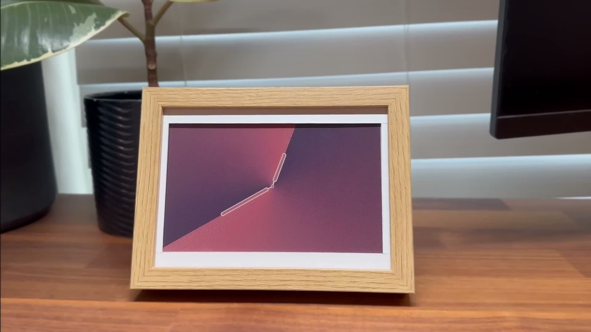

## 一、视频在做什么

视频的主角是一台 **7.3 英寸、7 色的电子墨水屏（E-Ink）显示器**，背后插着一块树莓派。它和普通屏幕最大的区别是：

- **低功耗、常亮**，不需要背光；
- 画面像打印在纸上，没有刺眼的光晕；
- 屏幕上没有任何 LED、噪音或通知，只在需要时安静地刷新内容。

而真正让它"活"起来的，是一个叫 **InkyPi** 的开源软件：它在这块墨水屏上跑了一个 **Web 界面**，你从浏览器里就能更新画面、切换各种"插件"——传一张照片上去、显示一个时钟、甚至定时轮换。

作者在视频里完整演示了从零搭建这台机器的过程：买哪些硬件、怎么组装、怎么刷系统、怎么装软件、怎么用浏览器控制它。下面是全程拆解。

## 二、他买了哪些东西（购物清单）

视频口播明确列出的组件如下，作者说**自己凑齐这一套大约 110 美元**：

| 组件 | 具体型号 | 用途 |
| --- | --- | --- |
| 墨水屏 | **Pimoroni Inky Impression 7.3"（7 色版）** | 显示本体；背面母口 GPIO 可直接插树莓派；侧面带 4 个物理按键 |
| 主控 | **Raspberry Pi Zero 2 W** | 小、低功耗、带 Wi-Fi；作者建议买**预焊排针**版 |
| 存储 | microSD 卡（≥8GB） | 刷 Raspberry Pi OS |
| 电源 | micro USB 供电线 | 给 Pi 供电 |
| 外壳 | **IKEA RÖDALM 木纹相框** | 作者喜欢木纹质感；需要自己裁相框卡纸、在背板开孔容纳树莓派 |

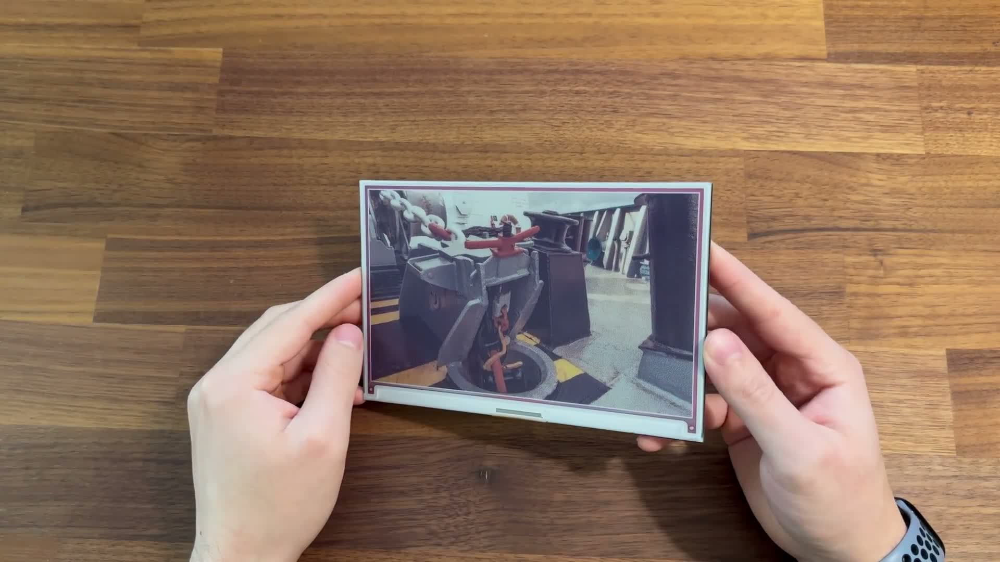

几个容易忽略的细节：

1. **7 色墨水屏刷新很慢**。作者特别提醒：这块 7 色屏刷新一次大约要 **30 秒**，而黑白墨水屏只要几秒——这是电子纸技术的物理限制，做交互式界面会不太顺手，但做"信息牌"完全够用。
2. **相框是手工改造的**。IKEA 相框的卡纸（matte）需要按屏幕尺寸裁掉中间部分，背板还要开一个口让树莓派嵌进去。不想动手的人也可以找网上的 **3D 打印外壳**方案。
3. 屏幕是整套最贵的单品。作者给的 110 美元是"全套组件"的粗略口径，实际以购买链接现价为准。

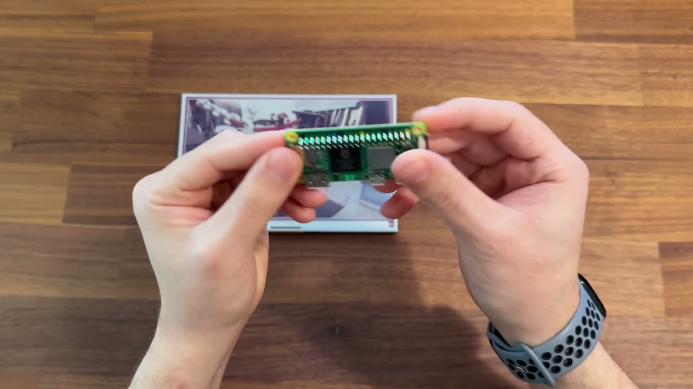

## 三、怎么组装

组装其实很简单，全程不需要焊接：

1. microSD 卡插进树莓派卡槽；
2. 把树莓派的 GPIO 排针对准墨水屏背面的母口，四角均匀用力压下去；
3. 装进改造好的相框；
4. 接上 micro USB 供电线。

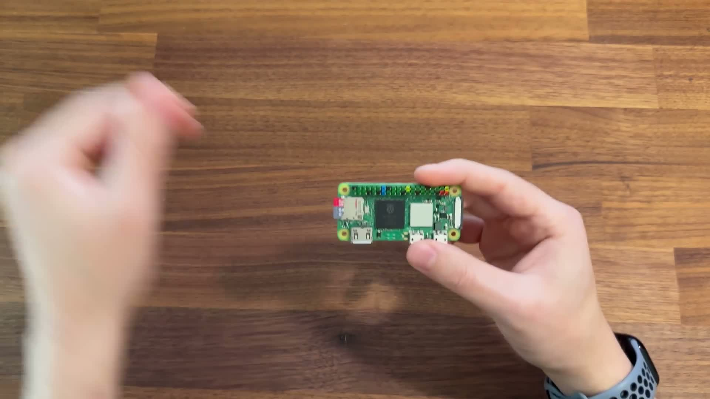

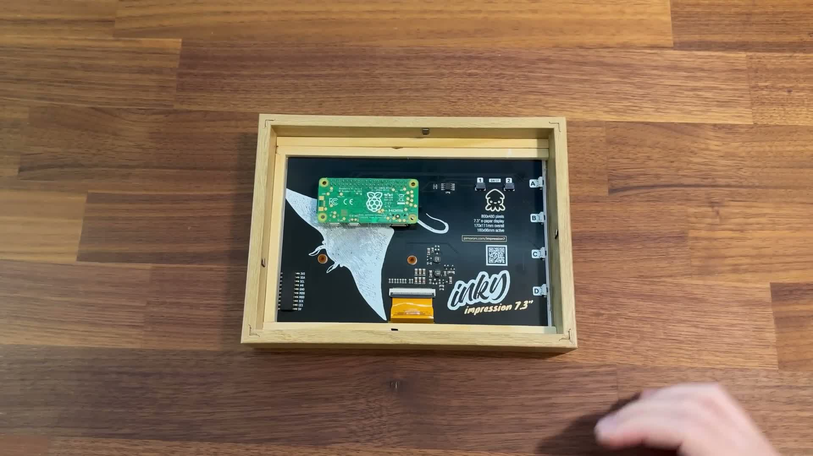

硬件部分到这里就结束了。真正"有技术含量"的部分在软件。

## 四、软件安装：从刷系统到开机自启

### 第一步：用 Pi Imager 刷系统

作者用树莓派官方工具 **Raspberry Pi Imager** 把 **Raspberry Pi OS** 烧到 SD 卡，并且在烧录时就完成系统定制：

- 设置主机名（演示里叫 `akz-inky`，浏览器访问 Web UI 就靠它）；
- 设置默认用户名和密码；
- 写入 Wi-Fi 凭据，设置时区；
- 在 Services 里打开 **SSH（密码认证）**，方便后面远程登录。

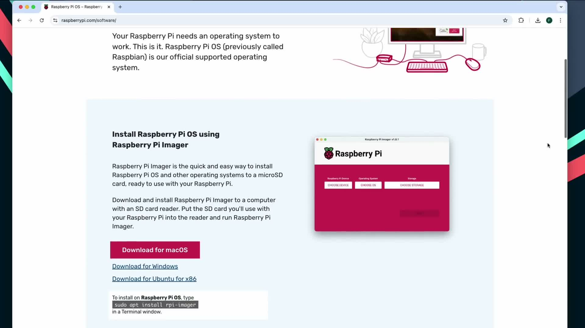

### 第二步：SSH 进树莓派

SD 卡插回去、上电，就能从电脑终端 SSH 登录：

```bash
ssh akz-pi@akz-inky.local
```

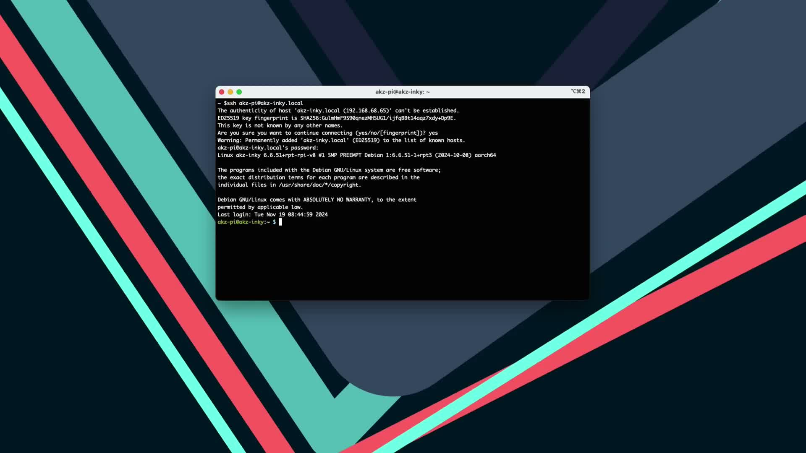

### 第三步：跑一键安装脚本

克隆 InkyPi 仓库后，用 root 执行它的安装脚本（视频画面里逐字可见）：

```bash
git clone https://github.com/fatihak/InkyPi.git
cd InkyPi
sudo bash install/install.sh
```

这个脚本会替你完成所有脏活累活，从终端输出可以清楚看到它依次做了：

- 启用 **SPI 与 I2C 接口**（驱动墨水屏必需）；
- 安装系统依赖；
- 把代码装到 `/usr/local/inkypi`；
- 创建 **Python 虚拟环境**，把可执行文件放到 `/usr/local/bin/inkypi`；
- 安装 Python 依赖，拷贝配置文件；
- 注册 **systemd 服务** `inkypi.service`，让它**开机自启**；
- 最后提示重启树莓派。

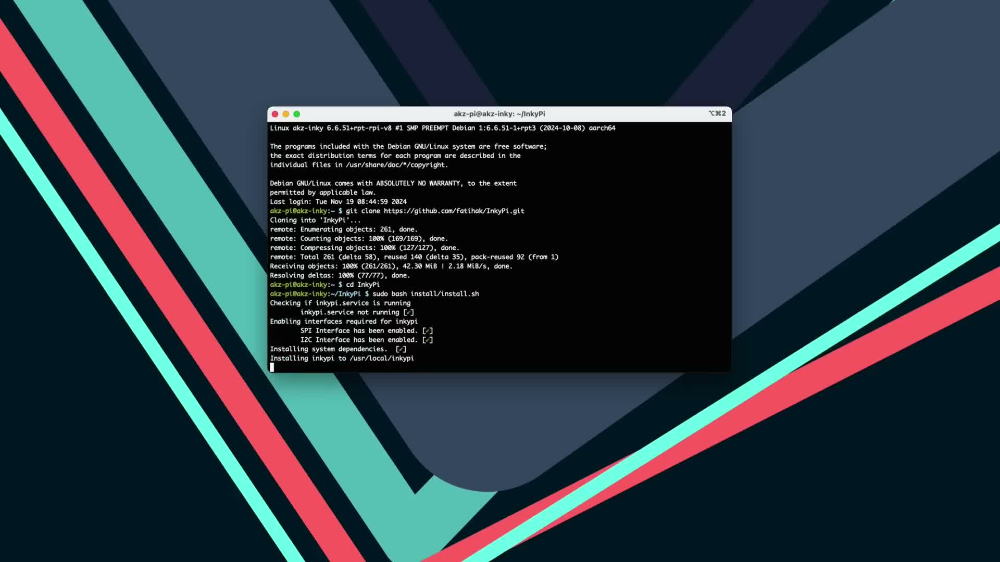

> 小知识点：到这里你会发现，这个"墨水屏时钟"的本质是一台**常驻的 Python 服务**。树莓派一开机，systemd 就把 InkyPi 拉起来，墨水屏随即显示启动画面。用户平时根本不用碰它。

### 第四步：看到启动画面

重启完成后，墨水屏会刷新出 InkyPi 的 splash 画面，上面直接写着 Web UI 的访问地址（如 `akz-inky.local`）。

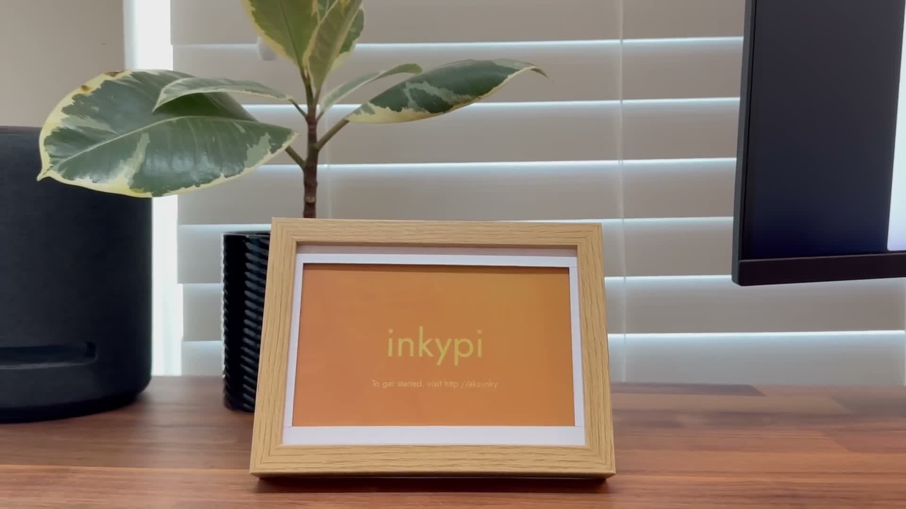

## 五、Web UI：在浏览器里控制墨水屏

在浏览器打开 splash 上的地址，就进入了 InkyPi 的管理界面。视频演示了两个核心操作。

### 传一张照片

Image Upload 插件支持从浏览器直接上传任意图片，选完点 **Update Now** 就显示到墨水屏上，也可以设置 **Schedule** 定时刷新。

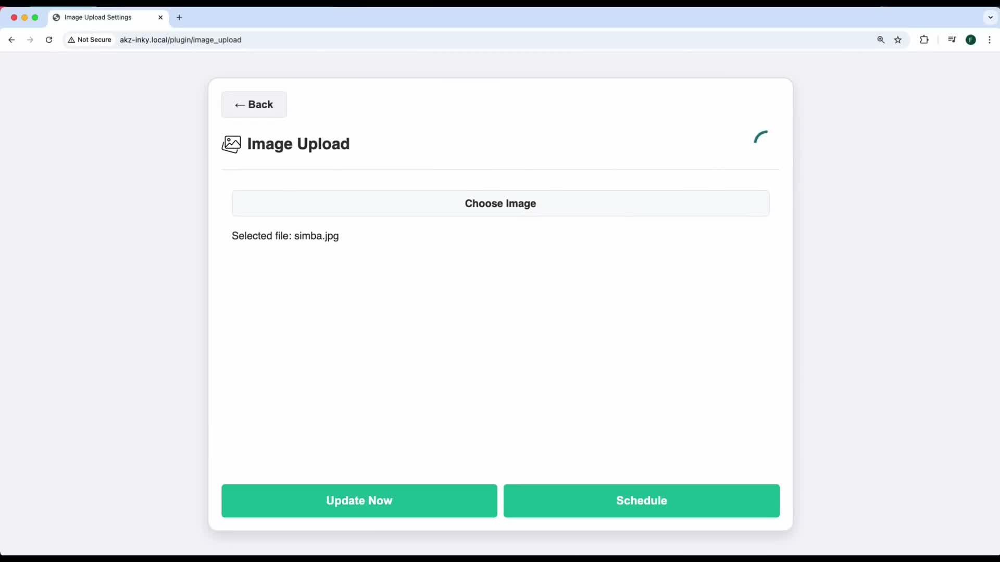

### 挂一个时钟

Clock 插件内置多种表盘，可以设置**时区**（视频里选的是 US/Eastern）和**刷新频率**。画面是在树莓派本地用 Python 的 **Pillow** 库渲染生成的——作者个人最喜欢的是受 Apple Watch 启发的那款渐变表盘。

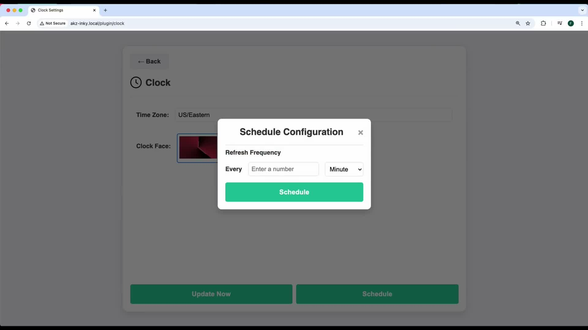

作者说视频录制时 InkyPi 只有这两个插件，但他明确预告了后续方向：**AI 文生图、每日报纸头版**等。而实际上，上游仓库后来已经陆续加入了大量插件（见下文）。

## 六、彩蛋：这个项目现在不止于此

写这篇文章时我还顺手查了一下视频里那个仓库的现状，有两个发现值得分享：

1. **视频里装的仓库和你想找的可能是同一个项目的不同副本。** 视频作者 AKZ Dev 的活跃仓库是 `fatihak/InkyPi`（README 官方地址、约 4.2k star、仍在更新）；GitHub 上还有一个 `anton-ovcharenko/InkyPi`，它其实是前者的 **fork**——页面明确标注 "forked from fatihak/InkyPi"，内容停在 2025 年年中，只多了一个自己的图像缩放策略改动。**如果你想动手复刻，建议直接用 `fatihak/InkyPi`。**
2. **上游已经远超视频里的两个插件。** 现在的 InkyPi 内置了大量插件：每日漫画、倒计时、GitHub 数据、RSS、待办清单、Unsplash 图源、Wikipedia 每日一图、年度进度条等等，还新增了 API Key 管理、深色模式、`inkypi-plugin` 命令行工具和 mock 显示（没有屏幕也能开发调试）。如果视频里的玩法不够过瘾，可以去它官网/wiki 逛一圈。

## 七、值不值得自己复刻一个？

**如果**你想要的是"一个不打扰人的信息屏"——挂墙上看时间、天气、每日一句、家人照片轮播——这套方案挺合适：

- ✅ 硬件成本可控（约 $110 起步）；
- ✅ 安装是一键脚本，不要求你会写代码；
- ✅ 插件生态 + 开源，扩展空间大；
- ⚠️ 7 色屏刷新慢（约 30s），只适合低频内容；
- ⚠️ 需要一点手工（裁相框卡纸），或者另购 3D 打印外壳。

对我来说，这项目最打动人的不是屏幕本身，而是它把"硬件 + Web 服务 + 插件架构"揉成了一个**开箱即用的整体**——花一个下午，你也能在墙上挂一台永不停机的"纸上信息台"。

---

*本文基于对 AKZ Dev 视频《Minimal E-Ink Clock with a Raspberry Pi》(YouTube) 的完整口播转写与画面逐帧分析撰写，并核对 InkyPi 仓库（fatihak/InkyPi）现状。文中所涉价格为视频作者口播口径。*
